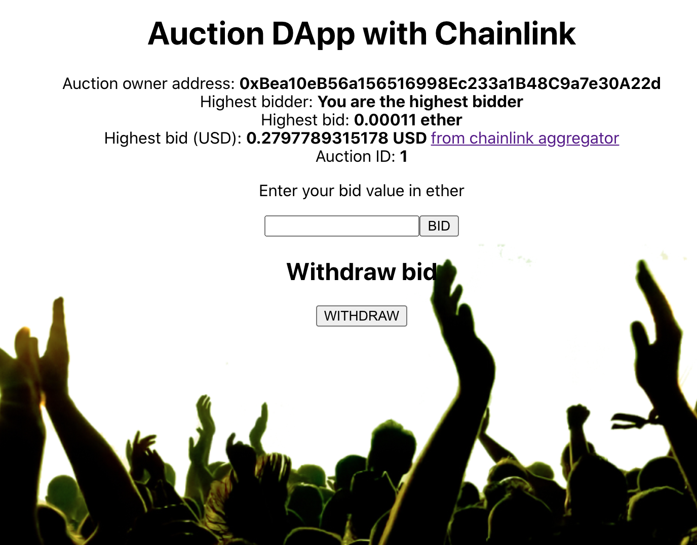

# Auction Dapp with Chainlink

Auction Dapp with the Chainlink AggregatorV3Interface for a ETH/USD price feed.


## Chainlink Oracle

Code borrowed from [chainlink docs](https://docs.chain.link/docs/get-the-latest-price/).

```solidity

AggregatorV3Interface internal priceFeed;

/**
* Network: Kovan
* Aggregator: ETH/USD
* Address: 0x9326BFA02ADD2366b30bacB125260Af641031331
*/
constructor() public {
    priceFeed = AggregatorV3Interface(0x9326BFA02ADD2366b30bacB125260Af641031331);
}

/**
    * Returns the latest price
    */
function getThePrice() public view returns (int) {
    (
        uint80 roundID, 
        int price,
        uint startedAt,
        uint timeStamp,
        uint80 answeredInRound
    ) = priceFeed.latestRoundData();
    return price;
}
```

## Solidity Contracts

Solidity contracts are in the [contracts](src/backend/contracts) folder. The backend was built using [trufflesuite](https://www.trufflesuite.com/).

### `truffle init`

Initialises truffle in the `backend` folder.

### `truffle migrate --network kovan`

Deploy to kovan test network. You'll have to update the `truffle-config` file with your metamask and infura credentials. 

# Deployment

Deployed on the Kovan test network. 



Availiable here: https://spiyer99.github.io/auction_dapp_chainlink_v2/

# Frontend

This project was bootstrapped with [Create React App](https://github.com/facebook/create-react-app).

## Available Scripts

In the project directory, you can run:

### `yarn start`

Runs the app in the development mode.<br />
Open [http://localhost:3000](http://localhost:3000) to view it in the browser.

The page will reload if you make edits.<br />
You will also see any lint errors in the console.

### `yarn test`

Launches the test runner in the interactive watch mode.<br />
See the section about [running tests](https://facebook.github.io/create-react-app/docs/running-tests) for more information.

### `yarn build`

Builds the app for production to the `build` folder.<br />
It correctly bundles React in production mode and optimizes the build for the best performance.

The build is minified and the filenames include the hashes.<br />
Your app is ready to be deployed!

See the section about [deployment](https://facebook.github.io/create-react-app/docs/deployment) for more information.

### `yarn eject`

**Note: this is a one-way operation. Once you `eject`, you can’t go back!**

If you aren’t satisfied with the build tool and configuration choices, you can `eject` at any time. This command will remove the single build dependency from your project.

Instead, it will copy all the configuration files and the transitive dependencies (Webpack, Babel, ESLint, etc) right into your project so you have full control over them. All of the commands except `eject` will still work, but they will point to the copied scripts so you can tweak them. At this point you’re on your own.

You don’t have to ever use `eject`. The curated feature set is suitable for small and middle deployments, and you shouldn’t feel obligated to use this feature. However we understand that this tool wouldn’t be useful if you couldn’t customize it when you are ready for it.

## Learn More

You can learn more in the [Create React App documentation](https://facebook.github.io/create-react-app/docs/getting-started).

To learn React, check out the [React documentation](https://reactjs.org/).

### Code Splitting

This section has moved here: https://facebook.github.io/create-react-app/docs/code-splitting

### Analyzing the Bundle Size

This section has moved here: https://facebook.github.io/create-react-app/docs/analyzing-the-bundle-size

### Making a Progressive Web App

This section has moved here: https://facebook.github.io/create-react-app/docs/making-a-progressive-web-app

### Advanced Configuration

This section has moved here: https://facebook.github.io/create-react-app/docs/advanced-configuration

### Deployment

This section has moved here: https://facebook.github.io/create-react-app/docs/deployment

### `yarn build` fails to minify

This section has moved here: https://facebook.github.io/create-react-app/docs/troubleshooting#npm-run-build-fails-to-minify
